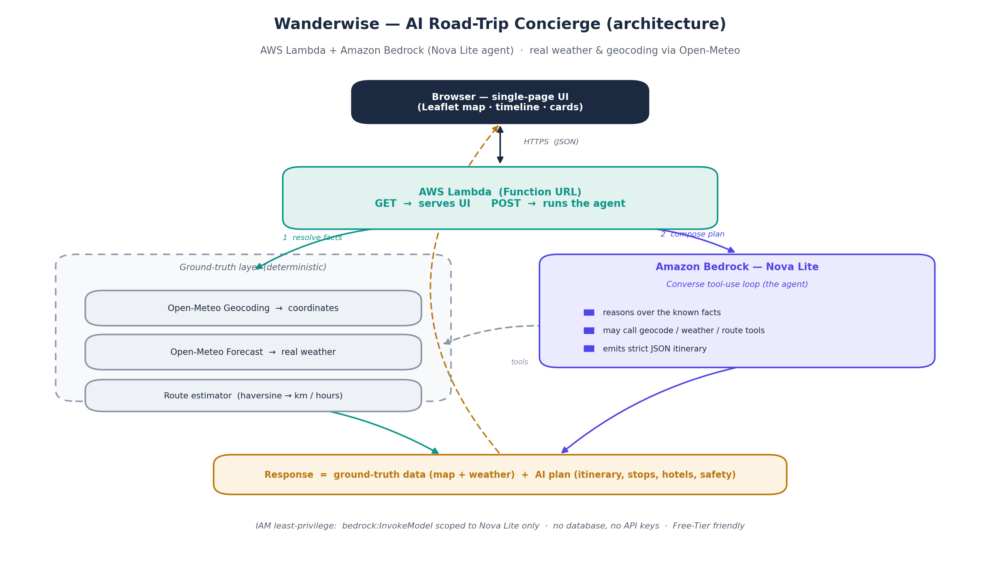

# Wanderwise — AI Road-Trip Concierge

Enter a start and destination and an AI **agent** plans the whole day: real weather at both
ends, a mapped route, meal stops with ratings, family-friendly hotels, kids' play areas,
timing, and layered safety checks (road / natural / area).

- **AI:** Amazon Bedrock — **Nova Lite** via the Converse API, run as a **tool-use loop** (the agent).
- **Ground truth:** real weather + geocoding from **Open-Meteo** (free, no API key) and a
  haversine route estimator — so the map and weather never depend on the model guessing.
- **Hosting:** a single **AWS Lambda** behind a **Function URL** (serves the UI *and* the API).
- **Cost:** Free-Tier friendly. No database, no API keys, no NAT.

## Architecture


1. `GET /` returns the single-page UI (Leaflet map, timeline, cards).
2. `POST /` → Lambda resolves ground-truth facts (geocode ×2, weather ×2, route), then runs
   the Nova agent, which may call the same tools for extra lookups and returns a strict JSON
   itinerary. The response combines **ground-truth data** (map + weather) with the **AI plan**.

## Prerequisites
- AWS account + AWS CLI configured (`aws configure`)
- AWS SAM CLI (`sam --version`)
- Python 3.12
- **Enable Bedrock model access** for *Amazon Nova Lite* in the region you deploy to
  (Bedrock console → **Model access** → enable *Nova Lite*). IAM permission alone is not
  enough — this console toggle is the second gate.

## Deploy (about 2 minutes)
```bash
sam build
sam deploy --guided
# Stack name: wanderwise   | Region: us-east-1 (or a Nova-enabled region)
# Accept the defaults; allow SAM to create roles.
```
The output **`AppUrl`** is your live app — open it in a browser.

Redeploys after edits: `sam build && sam deploy`.

## Configuration
- `MODEL_ID` (template parameter / env var) defaults to the cross-region inference profile
  `us.amazon.nova-lite-v1:0`. Override with `sam deploy --parameter-overrides ModelId=...`.

## Notes / honesty
- Weather, geocoding and route distance are **real**. Restaurants, hotels, kids' areas and
  safety notes are **AI-generated suggestions** — verify hours and book before travelling.
- The Function URL is public (`AuthType: NONE`) for an easy demo. Add Cognito / IAM auth,
  and consider Bedrock Guardrails, before anything production.

## Local sanity tests (offline, no AWS)
```bash
cd src && pip install boto3 --break-system-packages
PYTHONPATH=. python3 ../tests/test_app.py
```

## Clean up
```bash
sam delete
```
